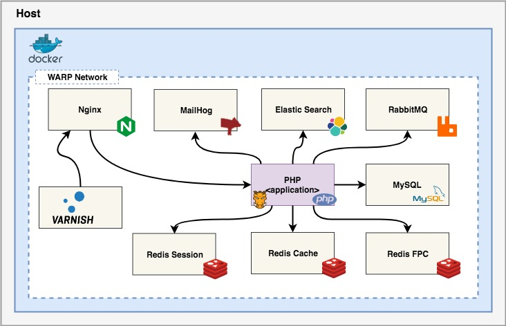

# Warp Engine

## Overview


```
  ___ ____     ____        _____
 ____      ___      ______      ___
      _  ___  __    ___        ____
 ___ | |     / /___ __________       ____
     | | /| / / __ `/ ___/ __ \ __    ___
 ___ | |/ |/ / /_/ / /  / /_/ / __  ___
 _   |__/|__/\__,_/_/  / .___/    ___   ____
  __   ___    ____    /_/  ___   __   __
      ____     ___   ____  __   ______
 ____      ___      ______    ____   ____

 WARP ENGINE - Speeding up! your development infraestructure
```

## Warp Architecture




## Features

* Nginx
* PHP
* MySQL
* Rabbit
* MailHog
* Elasticsearch
* Varnish
* Remote
* Selenium
* PostgreSQL

## Requirements

* Docker Community Edition
* Docker Compose


## Installation

Run the following command in your root project folder:

```bash
  curl -u "bestworlds:Sail7Seas" -L -o warp https://packages.bestworlds.com/warp-engine/release/latest && chmod 755 warp
```

## Command line update

Run the following command in your root project folder:

```bash
  curl -u "bestworlds:Sail7Seas" -L -o warp https://packages.bestworlds.com/warp-engine/release/latest && chmod 755 warp && ./warp update
```

## Getting started

After download the warp binary file, you should initialize your dockerized infrastructure running the following command:

```
 ./warp init	
```

## Useful warp commands

This repo comes with some useful bash command:

|  Command  | Description                                                              |
|  -------  |------------|
| **warp --help** | Shows the warp tool help                                                 |
| **warp [command] --help** | Shows the specific command help. For instance: warp php --help           |
| **warp info** | Shows the configured values and useful information for each services     |
| **warp init** | Initialize the warp framework the first time before to start the project |
| **warp start** | Starts the containers                                                    |
| **warp stop** | Stops the containers                                                     |
| **warp reset** | Reset config to default                                                  |
| **warp fix** | Fix common problems with permissions                                     |


## Licensing

**Warp Engine Framework** is licensed under the Apache License, Version 2.0.
See [LICENSE](LICENSE) for the full license text.

## Changelog

### See what has changed: [changes](CHANGES.md)