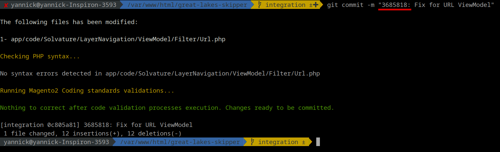
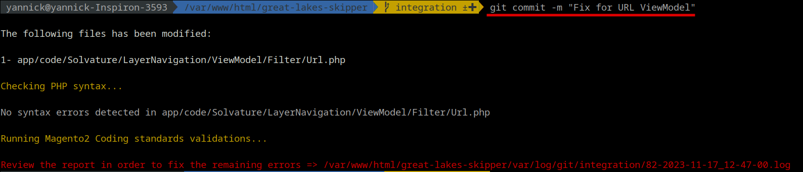
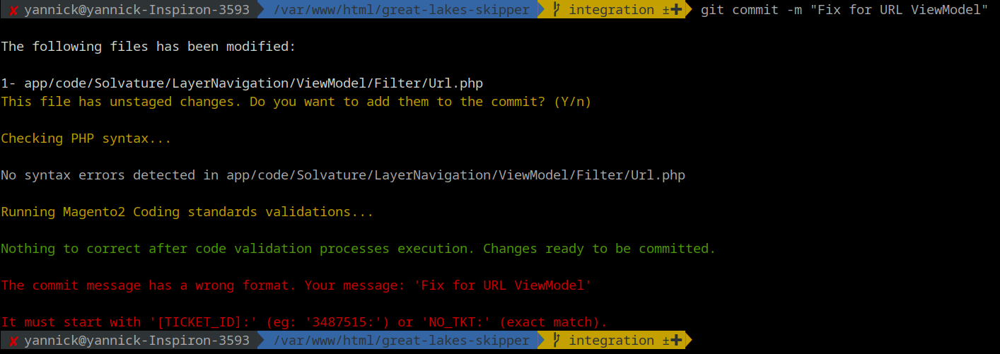

# Implement Code Review

## Git Hooks

Warp took advantage of [Git Local Hooks Feature](https://git-scm.com/docs/githooks) in order to implement an automatic code review validation on two different hooks:
- Pre Commit
- Prepare Commit Message

Git uses its own folder to allow adding local hooks for different events. All of them are located within the following directory at the root folder:
```
.git/hooks/[hook_identifier].sample
```
All .samples are ignored but by creating a new one with the same name but without that suffix, Git automatically executes that script (bash script).

_¿How is Warp connecting to Git hooks?_
The .git folder is not versioned so we can't put anything there in order to apply these code review validations. That's why we've mirrored the directory under the warp folder and then everytime warp is getting started an "rsync" command is executed between warp git folder and actual git folder.
```
.warp/docker/git -> .git

# Eg:
.warp/docker/git/hooks/pre-commit -> .git/hooks/pre-commit
```

Manual rsync through warp command:
```
warp git rsync
```

The main reason to use this feature is to apply code review validations before creating a Pull Request or even pushing any changes to a remote branch. 
To achieve that Warp uses the [PHP Code Sniffer Package](https://github.com/squizlabs/PHP_CodeSniffer).   

### Pre Commit
This hook is executed right after a Git user executes a _git commit_ command on its console.

Validations Steps:
<ol>
    <li>Prints all files that has been modified and are ready to be commit _(if a file was already added to commit but it also has changes, warp offers you to re-add it to commit with the new changes applied)_</li>
    <li>Checks correct syntax on each one of them (only for PHP files)</li>
    <li>Executes two different standard validations (PHPCS Tool):
    <ol>
        <li>Magento2, PSR1, PSR2, Zend: .php|.phtml|.html|.less|.xml file extensions</li>
        <li>Squiz: JavaScript files (.js)</li>
    </ol>
    <li>Performs an automatic fix of those errors that might be fixable through PHPCBF Tool.</li>
    <li>Re-add files with changes to the commit (if there are any) and re-executes once again step 3</li>
    <li>If there were no more errors, Git commits follows the regular flow and continues with the next step</li>
    <li>If there still are remaining errors, a report file (.log) is created under "var/log/git/[branch_id]/[report_qty]_[current_date].log (Eg: var/log/git/feature-39592811-erp-order-history/1-2023-12-11_22-10-15.log)</li>
</ol>

No remaining errors. Regular commit flow:


Report generated when there still are remaining errors:


### Prepare Commit Message
This hook is executed right after the Pre Commit hook described above. It is meant to be for validating commit message in order to prevent bugfixes, features or hotfixes without a task link.
Warp executed a simple validations at the beginning of the message where one of these two conditions must be fulfill in order to allow the commit to be successfully executed:
<ol>
    <li>Message must start with '[TICKET_ID]:' (eg: '3487515:').</li>
    <li>Message must start with 'NO_TKT:' (exact match). This is only for emergency cases and should be avoid every time is possible.</li>
</ol>

When message is correct:


When message is **not** correct:


### Setting up warnings and errors
Warp allows to create environment configurations in order to elevate the floor of the warning and errors **severity** to take into account for each standard. That's why the .env.sample file counts with the following:
```
GIT_CS_MAGENTO2_STANDARD_WARNING_SEVERITY=1
GIT_CS_MAGENTO2_STANDARD_ERROR_SEVERITY=1
GIT_CS_SQUIZ_STANDARD_WARNING_SEVERITY=1
GIT_CS_SQUIZ_STANDARD_ERROR_SEVERITY=1
```

The default value is "1" so any warning or error is reported but sometimes the warnings or errors are hundreds and it doesn't make sense to spend that amount of time fixing them. For those cases -specially on .less files- you can raise that floor value and the Code Sniffer will bypass everything under that specific value.

Those configurations should be copy to the actual .env file in order to have effect on the script.
